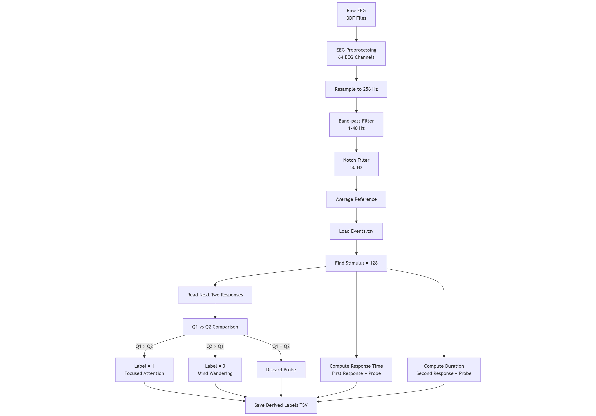
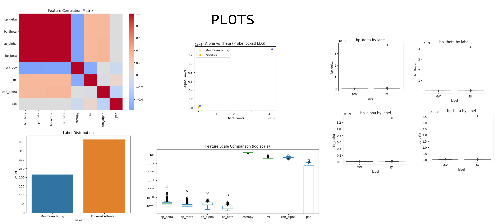

# EEG-Based Meditation & Mind-Wandering Classification  
*A comprehensive exploration of representation limits in EEG-based cognitive state decoding*

> ⚠️ **Project Status: Paused (Ceiling Reached)**  
> This research was intentionally **called off after reaching a performance ceiling**, indicating that further gains would require changes in dataset design or problem formulation rather than additional modeling.  
>  
> **The repository remains open for pull requests, replication, extensions, and new research directions.**

---

## 🧠 Motivation

Electroencephalography (EEG) is widely used to study meditation, attention, and mind-wandering.  
Despite decades of work, **robust subject-independent classification remains elusive**, with many studies plateauing around 70–80% accuracy.

This project was undertaken to **systematically investigate why**.

Rather than chasing incremental accuracy improvements, the goal evolved into:

> **Understanding the representational and labeling limits of EEG-based meditation classification.**

---

## 🎯 Research Questions

1. How far can classical and modern EEG representations push meditation vs mind-wandering classification?
2. Do advanced representations (e.g., Riemannian geometry) overcome known EEG limitations?
3. Is the performance ceiling driven by **models**, **features**, or **labels**?
4. When should a research direction be stopped on scientific grounds?

---

## 📂 Dataset

- **Dataset**: OpenNeuro `ds001787`
- **Task**: Focused Attention Meditation
- **Modality**: 64-channel EEG (BioSemi)
- **Labels**: Probe-based self-reports (Q1 vs Q2)
- **Sampling Rate**: 256 Hz
- **Evaluation**: Subject-wise cross-validation (GroupKFold)

> ⚠️ Probe-based labels are known to be **subjective, noisy, and temporally misaligned**, which became central to our findings.

---

## 🧪 Pipelines Implemented

This repository contains **three complete and rigorously evaluated EEG pipelines**, all built from scratch.

Pipe line used : 

Plots i have created after the pipeline:(EDA)

---

### 1️⃣ Global / Handcrafted Features
- Band power (δ, θ, α, β)
- Entropy
- Mutual Information
- Coherence
- Phase–Amplitude Coupling (PAC)

**Models**:
- Logistic Regression
- SVM
- Random Forest
- XGBoost
- CatBoost

**Outcome**:  
Performance plateau around **F1 ≈ 0.65–0.67**

---

### 2️⃣ Region-Based Spectral Features (Neurophysiology-Aligned)

**Improvements introduced**:
- Anatomical regions (Frontal, Central, Parietal, Occipital)
- Mean **log bandpower** per region
- **Relative power** (band / total 1–40 Hz)
- Cognitive ratios:
  - θ/β
  - α/θ
- Shorter **10-second windows** with overlap

**Outcome**:  
Performance plateau around **F1 ≈ 0.68–0.72**

> Region-based features improved interpretability but remained sensitive to label noise under short windows.

---

### 3️⃣ Riemannian Geometry (Most Robust)

**Canonical pipeline**:
- 64×64 covariance per window
- Tangent space mapping
- Linear classifiers (Logistic Regression, SVM)

**Why Riemannian?**
- Captures full inter-channel relationships
- Robust to scale and noise
- Theoretically grounded for EEG

**Outcome**:  
Best performance achieved: **F1 ≈ 0.78–0.80**

> This result aligns closely with published literature and appears to represent the dataset’s empirical ceiling.

---

## 📊 Key Findings

### ✅ What Worked
- Riemannian representations consistently outperformed spectral features
- Subject-wise CV exposed true generalization limits
- Feature engineering improvements showed diminishing returns

### ❌ What Did Not Scale Further
- Longer windows (state mixing)
- Shorter windows (label noise amplification)
- Additional classifiers or hyperparameter tuning

---

## 🧱 Final Conclusion

> **The limiting factor is not the model or representation — it is the label quality and problem formulation.**

Probe-based meditation labels are:
- Subjective
- Retrospective
- Temporally coarse

This introduces **irreducible uncertainty**, placing a hard ceiling on achievable accuracy.

Continuing beyond this point would require:
- A new dataset
- A new labeling strategy
- Or a new research question

---

## 🛑 Why This Project Was Paused

The research was **intentionally stopped** after:

- Exhaustive feature and model exploration
- Confirmation of a reproducible performance ceiling
- Alignment with limitations reported across the literature

This decision reflects **scientific rigor**, not failure.

---

## 🚀 Open Research Directions (Contributions Welcome)

Although this project is paused, the codebase is mature and reusable.  
We actively welcome **pull requests** exploring:

- 🔹 Uncertainty-aware EEG classification
- 🔹 Multi-level or continuous meditation state modeling
- 🔹 Temporal transition analysis (pre-probe dynamics)
- 🔹 Subject-adaptive or hierarchical models
- 🔹 Application to cleaner EEG datasets (fatigue, workload, MI)

---

## 🧑‍💻 Code Highlights

- Fully reproducible preprocessing
- Clean separation of:
  - preprocessing
  - windowing
  - feature extraction
  - model training
- Subject-wise evaluation (no leakage)
- Single-file pipelines for clarity

---

## 🤝 How to Contribute

1. Fork the repository
2. Create a feature branch
3. Clearly describe:
   - the new research question
   - why it overcomes known limitations
4. Submit a pull request

We value **scientific insight over accuracy chasing**.

---

## 📜 Acknowledgements

This work was conducted under academic supervision with an emphasis on:
- Neuroscience integrity
- Methodological transparency
- Knowing when to stop

If you are a student reading this:  
**Reaching a ceiling is not failure — it is a result.**

---

## 📌 Citation

If you use this code or analysis framework, please cite the repository and relevant EEG meditation literature.

---

## ✨ Final Note

This repository stands as a **complete research journey**, from hypothesis to ceiling detection.

If it helps others avoid redundant effort — it has already succeeded.
